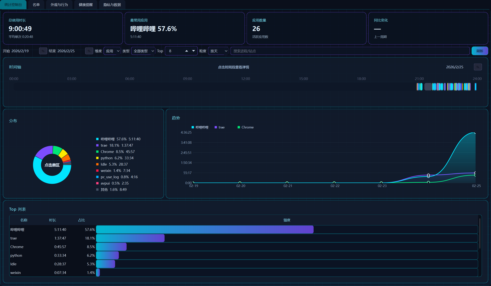

# AI Time Tracker (AI时间监控控制台)

这是一个基于 Python (PySide6) 开发的本地化 PC 使用时间追踪工具。它能够自动记录当前活动窗口和浏览器访问的网站，生成详细的使用统计报表和时间轴，帮助用户量化时间投入，提升效率。

## ✨ 主要功能

### 1. 全自动时间追踪
- **应用监控**：实时记录当前处于焦点的应用程序名称及使用时长。
- **网页追踪**：配合浏览器扩展，可详细记录访问的网站域名及停留时间。
- **闲置检测**：自动检测键鼠无操作状态或系统锁屏，记录为“Idle”闲置时间，确保数据准确。

### 2. 可视化统计控制台
- **多维度图表**：提供饼图（分布占比）、趋势图（时间变化）等多种可视化分析。
- **每日时间轴**：以时间轴形式直观展示全天的活动序列，支持缩放和点击查看详情。
- **历史回溯**：内置自定义日期选择器，可查看任意历史日期的使用数据。

### 3. 应用管理 (名单)
- **应用列表**：查看所有被记录过的应用程序。
- **黑名单机制**：支持一键屏蔽特定应用（不再记录其时间）。
- **数据清理**：可单独删除某个应用的全部历史记录。

### 4. 健康与辅助
- **悬浮球**：可选的桌面悬浮窗，实时显示当前应用及今日总时长。
- **健康提醒**：支持配置久坐提醒，帮助保持健康的工作节奏。

### 5. 隐私与安全
- **完全本地化**：所有数据存储在本地 SQLite 数据库 (`timetracker.db`) 中，不上传任何服务器。
- **隐私控制**：提供数据清除选项，完全掌控自己的数据。

## 🚀 使用方法

### 运行程序
1. **直接运行**：双击生成的 `AI Time Tracker.exe` 即可启动。
2. **源码运行**：
   ```bash
   pip install -r requirements.txt
   python -m timetracker.main
   ```

### 界面导航
启动后，程序会最小化到系统托盘。双击托盘图标或右键选择“打开控制台”即可进入主界面。
- **统计控制台**：查看核心报表和时间轴。
- **名单**：管理应用列表和屏蔽设置。
- **外观与行为**：设置悬浮球开关、自启动等。
- **健康提醒**：配置休息提醒策略。
- **隐私与数据**：管理数据库和隐私选项。

### 浏览器插件安装
为了精确记录网页访问时间，请安装配套的浏览器扩展：
1. 打开 Chrome/Edge 浏览器的扩展管理页面 (`chrome://extensions`)。
2. 开启“开发者模式”。
3. 点击“加载已解压的扩展程序”，选择项目目录下的 `timetracker/browser_extension` 文件夹。

## 🛠️ 开发指南

### 环境要求
- Python 3.10+
- Windows 10/11

### 安装依赖
```bash
pip install -r requirements.txt
```

### 代码规范
提交代码前请确保通过静态检查：
```bash
ruff check .
mypy .
```

### 打包发布
本项目使用 Nuitka 进行打包，以获得更好的性能和独立性。
运行构建脚本：
```powershell
./scripts/build_nuitka.ps1
```
打包产物将生成在 `dist` 目录下。

## 📂 项目结构
- `timetracker/`
  - `tracker/`: 核心追踪逻辑与 WinAPI 调用
  - `ui/`: PySide6 界面实现 (Charts, Timeline, Widgets)
  - `storage/`: SQLite 数据库操作
  - `browser_extension/`: 浏览器插件源码
  - `scripts/`: 构建脚本
